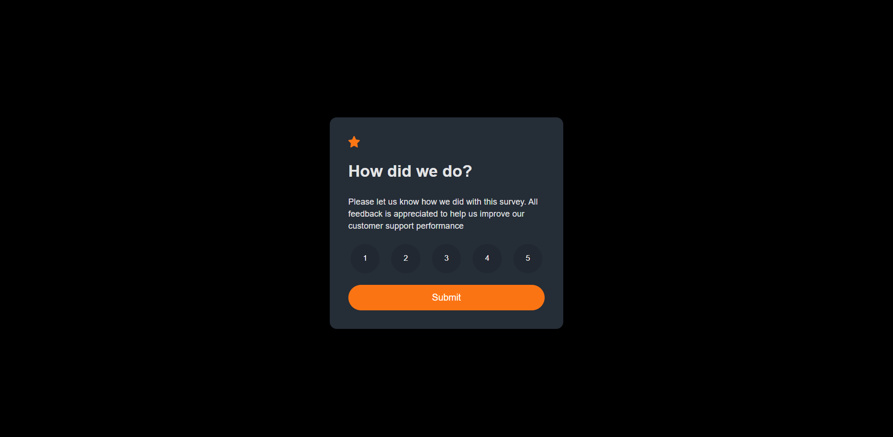
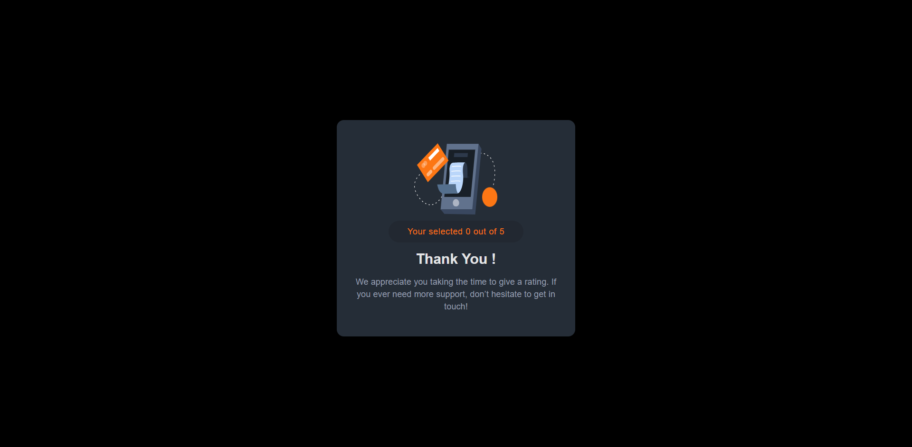

# Frontend Mentor - Interactive rating component solution

This is a solution to the [Interactive rating component challenge on Frontend Mentor](https://www.frontendmentor.io/challenges/interactive-rating-component-koxpeBUmI). Frontend Mentor challenges help you improve your coding skills by building realistic projects. 

## Table of contents

- [Overview](#overview)
  - [The challenge](#the-challenge)
  - [Screenshot](#screenshot)
  - [Links](#links)
- [My process](#my-process)
  - [Built with](#built-with)
  - [What I learned](#what-i-learned)
  - [Continued development](#continued-development)
  - [Useful resources](#useful-resources)
- [Author](#author)
- [Acknowledgments](#acknowledgments)

**Note: Delete this note and update the table of contents based on what sections you keep.**

## Overview

The Interactive Rating Card is a user interface component that allows users to rate and provide feedback on a particular item, such as a product, service, or experience. It provides a visually appealing and interactive way for users to express their opinions and experiences.

The rating card typically includes a visual representation of the rating scale, which can be represented by stars, thumbs up/down, smiley faces, or any other relevant symbols. Users can click or interact with these symbols to select their desired rating.

### The challenge

Users should be able to:

- View the optimal layout for the app depending on their device's screen size
- See hover states for all interactive elements on the page
- Select and submit a number rating
- See the "Thank you" card state after submitting a rating

### Screenshot

### Links

- Solution URL: [Add solution URL here](https://github.com/wolfgunblood/interactive-rating)
- Live Site URL: [Add live site URL here](https://wolfgunblood.github.io/interactive-rating/)

## My process

### Built with

- Semantic HTML5 markup
- CSS custom properties
- Flexbox
- CSS Grid
- Mobile-first workflow
- [React](https://reactjs.org/) - JS library

### What I learned

Throughout the code snippet provided, here's a summary of what you have learned:

- React JS: Enhancing your understanding of React's component-based architecture and state management.
- UI Design: Developing visually appealing rating cards and considering user experience.
- Event Handling: Implementing interactivity through event handling in React.
- Data Persistence: Learning about storing and retrieving user ratings and comments.
- User Engagement: Incorporating user feedback to improve the app's usability.

## Author

- Website - [Jalaj Doraiburu](https://wolfgunblood.github.io/portfolio/)
- Frontend Mentor - [@wolfgunblood](https://www.frontendmentor.io/profile/wolfgunblood)
- Twitter - [@jalaj_dorai](https://twitter.com/jalaj_dorai)

## Acknowledgments

I would like to express our gratitude to Frontend Mentor (https://www.frontendmentor.io) for providing the design and inspiration for this project. Frontend Mentor offers a vast collection of design challenges and projects that allow developers to enhance their skills by building real-world applications.
